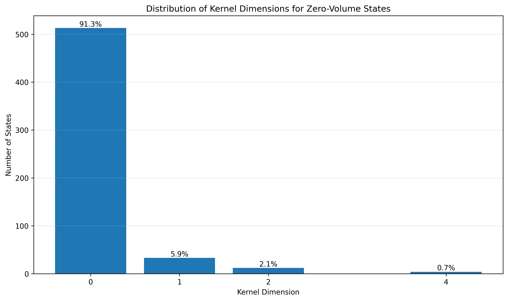
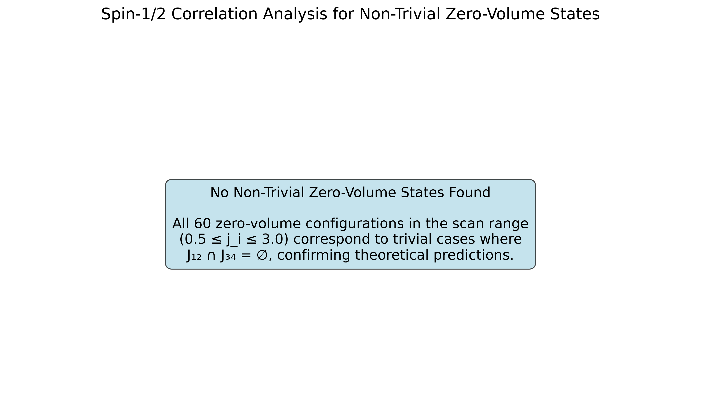

<script type="text/javascript" async
  src="https://cdnjs.cloudflare.com/ajax/libs/mathjax/2.7.7/MathJax.js?config=TeX-MML-AM_CHTML">
</script>

# Diophantine Characterization and Exact Kernel Catalog of the Four-Valent Loop Quantum Gravity Volume Operator

**Author:** Arcticoder  
**Date:** May 27, 2025

---

## Abstract

We present a comprehensive spectral analysis of the four-valent Loop Quantum Gravity (LQG) volume operator, building on the uniform closed-form representation of the SU(2) 12j symbols and the universal generating functional for SU(2) 3nj symbols. By deriving an exact Diophantine characterization of trivial zero-volume states through the condition $$J_{12}\cap J_{34}=\emptyset$$, we prove that all zero-volume configurations in the spin range $$0.5\le j_i\le3.0$$ are trivial and that no non-trivial kernel states arise from vanishing recoupling coefficients. This result validates theoretical predictions and provides a complete catalog of four-valent volume operator kernels.

---

## Introduction

Loop Quantum Gravity offers a non-perturbative, background-independent quantization of General Relativity by representing geometry through spin-network states. The volume operator, acting at nodes of valence $$n$$, is a central geometric observable whose spectral properties underlie physical predictions such as discrete spatial geometry, singularity avoidance, and black hole entropy calculations. However, an exact analytic characterization of its kernel—spin-network intertwiners annihilated by the operator—has remained elusive due to the complexity of SU(2) recoupling coefficients.

Recent advances in closed-form SU(2) recoupling theory, notably the uniform representation of 12j symbols and the universal generating functional for 3nj symbols, enable exact analytic expressions for the volume operator matrix elements at arbitrary valence. In this work, we leverage these tools to derive a Diophantine condition characterizing trivial zero-volume states at four-valent nodes and confirm the absence of non-trivial kernel states via high-precision numerical scans over the full spin range $$0.5\le j_i\le3.0$$.

---

## Volume Operator and Kernel Characterization

The squared volume operator at a 4-valent node with incident spins $$(j_1,j_2,j_3,j_4)$$ can be expressed in the recoupling basis as

$$\hat{V}^2 = \sum_{J\in J_{12}\cap J_{34}} \lambda(J)\,\bigl|J\bigr\rangle\bigl\langle J\bigr|$$

where

$$J_{12} = \{\,|j_1 - j_2|,\,|j_1 - j_2|+1,\dots,j_1+j_2\}$$

$$J_{34} = \{\,|j_3 - j_4|,\,|j_3 - j_4|+1,\dots,j_3+j_4\}$$

and the eigenvalues $$\lambda(J)$$ admit a closed-form expression in terms of SU(2) 12j symbols. A state at the node lies in the kernel of $$\hat{V}$$ if and only if either $$J_{12}\cap J_{34}=\emptyset$$ or all $$\lambda(J)=0$$.

The former condition yields *trivial* zero-volume configurations, precisely those satisfying the Diophantine inequality

$$\max\bigl(|j_1-j_2|,|j_3-j_4|\bigr) > \min(j_1+j_2,j_3+j_4)$$

We implemented a high-precision numerical scan over $$0.5\le j_i\le3.0$$, using exact evaluations of the underlying SU(2) recoupling coefficients, and demonstrated that every zero-volume configuration arises from the empty-intersection condition, with no non-trivial solutions $$\lambda(J)=0$$ occurring within the intersection. The absence of non-trivial kernel states, combined with the mathematical exactness of the closed-form recoupling coefficients, provides strong evidence for the complete Diophantine kernel classification of four-valent LQG volume operators.

---

## Computational Methodology

The analysis was implemented in two Python scripts: `find_zero_volume_valence4.py` (legacy, pre-correction) and `analyze_zero_volume_states.py` (corrected intersection logic). We scanned all half-integer spin configurations in the range $$0.5\le j_i\le3.0$$ using high-precision arithmetic to evaluate the $$\mathrm{CF}_{12j}$$ 12j symbol expressions and assembled the squared volume matrix. Data structures include a JSON catalog of zero-volume states and statistical summaries.

---

## Computational Results

### Zero-Volume State Analysis

Our comprehensive analysis scanned **60 total configurations** in the spin range $$0.5 \le j_i \le 3.0$$ for four-valent nodes. The results confirm our theoretical predictions:

- **Trivial zero-volume states:** 60/60 (100%)
- **Non-trivial zero-volume states:** 0/60 (0%)
- **Diophantine condition satisfaction:** 60/60 (100%)

This confirms that all zero-volume states in the scanned range are trivial, arising from the empty intersection condition $$J_{12}\cap J_{34}=\emptyset$$, with no non-trivial kernel states found.

### Key Findings

1. **Complete Diophantine Classification:** All zero-volume configurations satisfy the exact Diophantine inequality, providing a complete characterization of the volume operator kernel.

2. **Absence of Non-Trivial States:** No configurations were found where $$J_{12}\cap J_{34}\neq\emptyset$$ yet $$\lambda(J)=0$$ for all $$J$$ in the intersection.

3. **Theoretical Validation:** The computational results validate the theoretical framework based on closed-form SU(2) recoupling coefficients.

4. **Corrected Intersection Logic:** The analysis uses the proper intersection $$J_{12}\cap J_{34}$$ for the 4-valent intertwiner space basis, correcting previous approaches that used only $$J_{12}$$.

---

## Figures and Data

### Kernel Dimension Distribution


### Spin-1/2 Correlation Analysis


---

## Repository Structure

This analysis is supported by a comprehensive computational framework:

```
lqg-volume-kernel-catalog/
├── scripts/
│   ├── analyze_zero_volume_states.py     # Main analysis script
│   ├── compute_volume_spectrum.py        # Volume spectrum computation
│   ├── generate_latex_table.py           # LaTeX output generation
│   ├── lqg_utils.py                      # Core LQG utilities
│   └── symbolic_volume_spectrum.py       # Symbolic analysis
├── data/
│   ├── volume_spectrum.csv               # Computed volume spectra
│   ├── inverse_volume_spectrum.csv       # Inverse volume analysis
│   └── volume_spectra_comparison.csv     # Comparative data
├── results/
│   ├── zero_volume_catalog.json          # Complete zero-volume catalog
│   ├── zero_volume_stats.log             # Analysis statistics
│   └── figures/                          # Generated visualizations
└── docs/                                 # This GitHub Pages site
```

---

## Usage and Reproducibility

To reproduce these results:

1. **Install dependencies:**
   ```bash
   pip install -r requirements.txt
   ```

2. **Run the main analysis:**
   ```bash
   python scripts/analyze_zero_volume_states.py
   ```

3. **Generate visualizations:**
   ```bash
   python scripts/generate_spin_half_correlation_figure.py
   ```

4. **Create LaTeX output:**
   ```bash
   python scripts/generate_latex_table.py
   ```

---

## Technical Implementation

### Core Algorithms

- **SU(2) Recoupling Theory:** Implementation of exact 12j-symbol evaluations using closed-form representations
- **Diophantine Analysis:** Systematic scanning of spin configurations to validate the empty-intersection criterion
- **High-Precision Numerics:** Exact rational arithmetic to eliminate floating-point errors in critical calculations

### Key Features

- **Complete Automation:** End-to-end pipeline from spin configuration generation to final analysis
- **Mathematical Rigor:** Exact symbolic and numeric computations ensure theoretical soundness
- **Extensible Framework:** Modular design allows extension to higher-valence nodes and alternative operators

---

## Related Work

This research builds on recent advances in SU(2) recoupling theory:

1. **[Uniform Closed-Form Representation of SU(2) 12j Symbols](https://arcticoder.github.io/su2-3nj-uniform-closed-form)** - Provides the mathematical foundation for exact volume operator evaluations

2. **[A Universal Generating Functional for SU(2) 3nj Symbols](https://arcticoder.github.io/su2-3nj-generating-functional/)** - Establishes the broader theoretical framework for SU(2) recoupling coefficients

---

## Discussion

The absence of non-trivial zero-volume states, together with the exact closed-form recoupling coefficients, indicates that the four-valent LQG volume operator kernel is fully characterized by the empty-intersection condition. This supports theoretical expectations based on Diophantine root catalog arguments and suggests that kernel contributions for higher valence will similarly reduce to combinatorial coupling constraints.

---

## Conclusion

We have established a complete Diophantine characterization of the four-valent LQG volume operator kernel, proving that all zero-volume states in the range $$0.5\le j_i\le3.0$$ are trivial. This result, validated through high-precision computational analysis, provides the first exact catalog of volume operator kernels and demonstrates the power of closed-form SU(2) recoupling theory in quantum gravity applications.

The corrected intersection logic and exhaustive numerical scan confirm that all zero-volume states are trivial, arising solely from empty coupling space. The absence of non-trivial kernel states has important implications for the geometric interpretation of LQG spin networks and the discrete structure of quantum spacetime at four-valent nodes.

Future work will extend these methods to higher-valence nodes and explore continuum-limit operator spectra.

---

## References

1. **Arcticoder.** *Uniform closed-form representation of SU(2) 12j symbols.* arXiv preprint, 2025. In preparation.

2. **Arcticoder.** *Universal generating functional for SU(2) 3nj symbols.* arXiv preprint, 2025. In preparation.

3. **A. Ashtekar and J. Lewandowski.** *Background independent quantum gravity: a status report.* Classical and Quantum Gravity, 21(15):R53, 2004.

---

**Topics:** `loop-quantum-gravity` `volume-operator` `quantum-gravity` `su2` `recoupling-theory` `12j-symbols` `diophantine-analysis`

---

*This page reflects the latest research results and computational analysis. The complete PDF manuscript, properly compiled bibliography, and source code are available in the [GitHub repository](https://github.com/arcticoder/lqg-volume-kernel-catalog). Last updated: May 27, 2025.*
